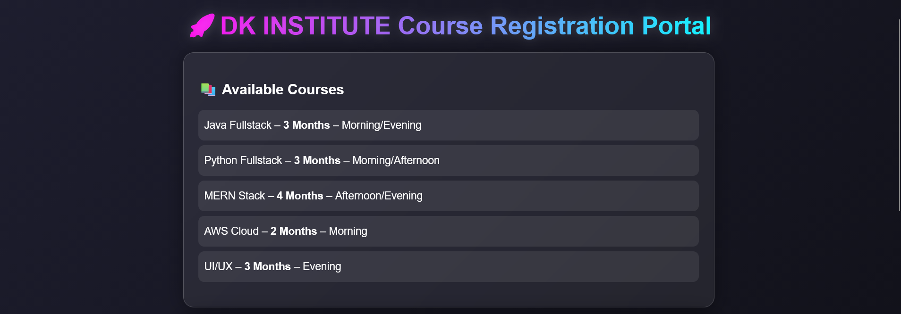
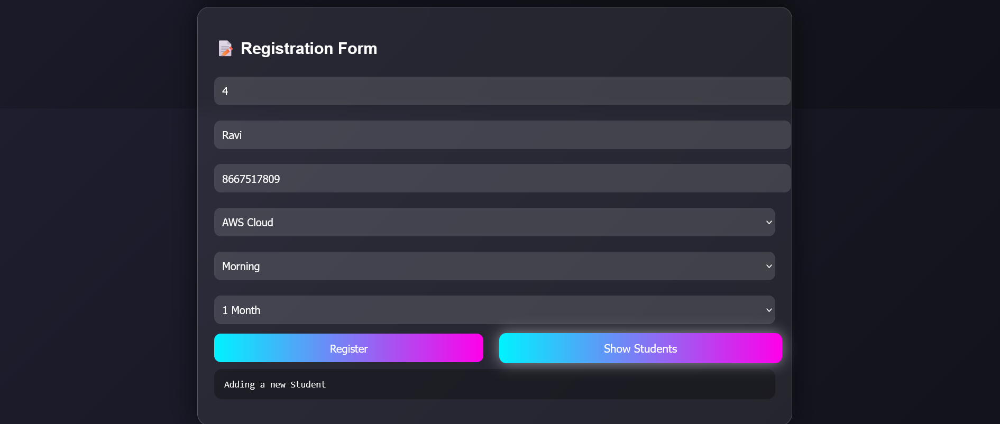

# Course Registration System

## 📌 Description
This is a web-based course registration system developed using Java Spring Boot and MySQL. It allows students to register and manage course details efficiently.

## 🚀 Features
- Student registration
- Course selection and management
- Backend API integration
- Data storage using MySQL
- Simple and responsive UI

## 🛠 Technologies Used
- Java
- Spring Boot
- MySQL
- HTML, CSS, JavaScript

## ▶️ How to Run
1. Clone the repository
2. Open in IntelliJ / Eclipse
3. Configure MySQL database
4. Run the Spring Boot application
5. Open browser and access the application

## 📸 Screenshots
### 🏠 Pamphlet Page

### 📝 Registration Page

### 📋 Student Details Page

## 📚 Learning Outcome
- Learned full stack development using Spring Boot
- Understood REST API integration
- Improved database handling skills
